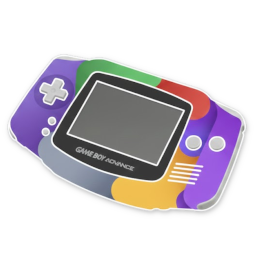
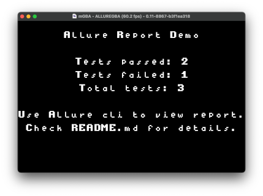
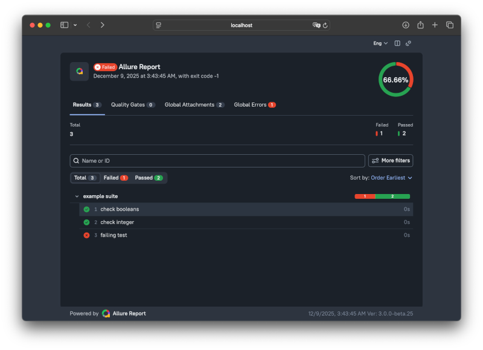

# Allure integration for Game Boy Advance

## Description

Allure-AGB is a mini test-framework that runs Game Boy Advance (GBA) ROMs under the mGBA emulator and produces Allure test reports. Tests are executed inside mGBA with a Lua adapter (located in `mgba/allure-adapter.lua`) that emits Allure-compatible JSON result files into `allure-results/`.



---

## Disclaimer

This project is in **Work In Progress** state. The current implementation supports only a limited set of Allure features and is intended for demonstration purposes only.

Note that this repository is an experimental proof of concept and is not intended for production use. It demonstrates the feasibility of integrating **Allure reporting** with GBA development using **mGBA**'s Lua scripting capabilities.

This project is not affiliated with or endorsed by the Qameta Software or its maintainers.

---

## Supported Platforms

- Butano v18.0.0+

---

## Prerequisites

- GNU Make
- Allure CLI (for generating and opening reports) — https://docs.qameta.io/allure/ (I recommend to install **Allure Report 3**)
- mGBA development release (v0.11+). This setup relies on the mGBA Lua API `setWatchpoint`, which is available in development builds (v0.11 and newer).

Notes:
- If you run into Lua errors referencing missing functions such as `setWatchpoint`, you are likely running a non-development mGBA build. Use a development build or build mGBA from source.

## Usage

1. Clean and build the project with Make (use an appropriate -j value for your CPU):

```bash
make clean; make -j64
```

2. Run tests under mGBA and produce an Allure report. Example (exact command used by the repository owner):

```bash
mgba  --script mgba/allure-adapter.lua allure-agb.gba
allure generate
allure open
# or simply:
allure run -- mgba --script mgba/allure-adapter.lua allure-agb.gba; allure open
```

Explanation:
- `make clean; make -j64` — builds the ROM (`allure-agb.gba`) and artifacts.
- `allure run -- <emulator> --script <adapter.lua> <rom>` — runs the emulator under the Allure runner. The Lua adapter writes JSON files into `allure-results/`.
- `allure open` — opens the generated Allure report in your browser.

If your mGBA binary is located elsewhere, replace the path in the examples with the path to your mGBA development binary.




---

## Requirements

1. **DevkitARM** ([Setup Guide](https://devkitpro.org/wiki/Getting_Started))
    - Windows: Use [DevkitPro Installer](https://github.com/devkitPro/installer/releases/latest).
    - macOS/Linux: Install via `devkitpro-pacman`.
      ```bash
      sudo dkp-pacman -S devkitARM
      ```
    - Verify: `arm-none-eabi-gcc --version`
2. **[Butano](https://github.com/GValiente/butano)**
3. ***For CLion IDE users***:
    - Install `compiledb`
        - macOS:
          ```bash
          brew install compiledb
          ```
        - Linux:
          ```bash
          pip install --user compiledb
          ```
    - Generate `compile_commands.json`:
      ```bash
      compiledb make -j$(nproc)
      ```
    - Import the project in CLion as a Compilation Database project
    - Configure the devkitARM toolchain in CLion (see devkitARM setup guides)

---

For more details about the repository layout and troubleshooting, check the `mgba/` folder (Lua adapter) and the `Makefile` at the project root.
